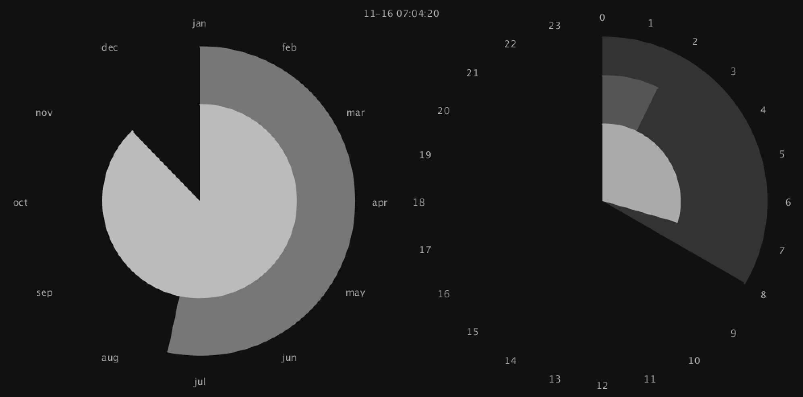
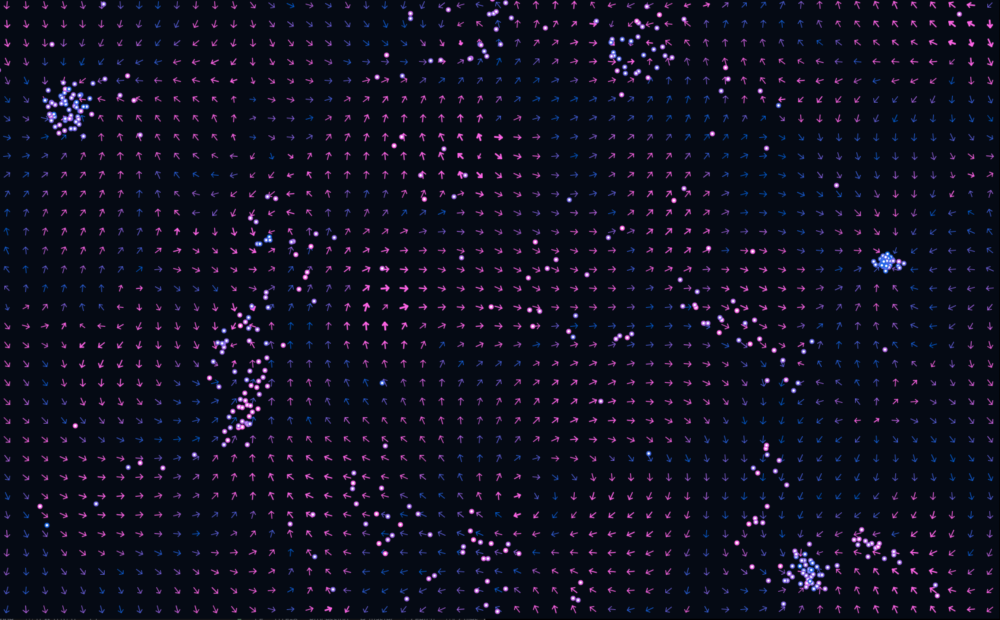

# processing sketches

Dabbling.

## flocks

birds of a feather

live: <http://circularly.org/flock>

[more info](./flock/README.md)

## clock

the long now

live: <http://circularly.org/clock>

## wind map

patterns in vector fields

live: <http://circularly.org/wind> and <http://circularly.org/wind/big>

## License

Copyright (C) WTFPL
