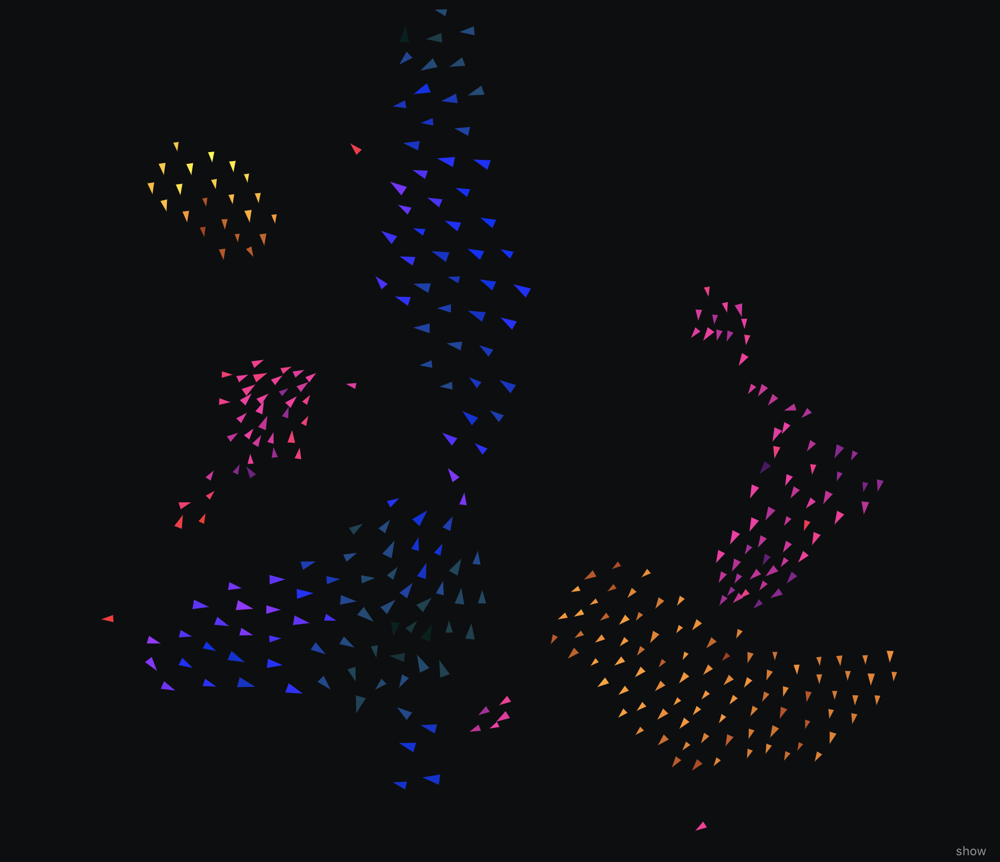

# flock

Flocking simulation. Birds, fish, bees, etc.

live: http://circularly.org/flock

Significantly inspired by boids:

- [Processing example](https://processing.org/examples/flocking.html) ([Nature of Code example](https://github.com/shiffman/The-Nature-of-Code-Examples/tree/master/chp06_agents/NOC_6_09_Flocking) on github)
- [Craig Reynolds's site](http://www.red3d.com/cwr/boids/)

## controls

Open the control panel with `;` or clicking the `show` button. Some key
controls:

- Sliders on the right to control the flocking algorithm, along with preset
  buttons.
- 2 sets of `-`/`+` buttons to change the number of flocks and number of nodes.

Mouse/touch controls:

- Click/touch: repel (or attract) nodes. On mobile: if 2 point touch is used,
  the point in between is used.
- Toggle between repelling and attraction: `mouse repel` checkbox in control
  panel. On mobile: a 3 point touch toggles between these two.
- On mobile: 4 point touch resets the flocks.

Keybindings:

- `;` toggle control panel
- `r` reset flocks
- `p` toggle pause

## enhancements / features

- Multiple flocks. Nodes from different flocks repel each other.
- Most algorithm parameters are tunable in real-time via the control panel with
  some "presets" available.
- Mouse/touch interaction: repel/attract nodes.
- Can dynamically change number of flocks, number of nodes, node speed, node
  size.
- Quadtrees for faster neighbor finding. Can handle ~1000 nodes reasonable well,
  at least in some configurations.
- Random visual flourishes.

## differences

Different separation/cohesion force implementation: The _alignment_ force is
largely the same as the classic boid algorithm. But instead of separate
_separation_ and _cohesion_ forces (repelling from neighbors that are within
space requirement, and attraction to center of mass of neighbors within
neighborhood), I use a single force between each node and its neighbors. The
node tries to keep neighbors within a set distance (`space_need`). There are
spring forces for neighbors that are too far, and repulsion forces for neighbors
that are too close.

Different neighbor algorithm: the idea is to find the closest neighbor _in each
direction_. If the flock has split in two and are side-by-side with some gap,
then a node that's on the left edge of the right flock will see nodes on the
right edge of the left flock as a neighbor, even if other nodes to the right are
closer. This results in more interesting shapes, with flocks often spreading out
more instead of cohering to more-or-less packed circular patterns. The usual
n-closest-neighbors-within-radius algorithm is also available.

## screenshots / videos

*  2018-12-01

  

- 2018-11-18 video. i think this was using some forces to adjust velocity
  instead of changing position directly, but still pretty janky.

  
- 2018-11-16 video. wasn't using forces in any principled way - just adjusting
  node position directly.

  

- 2018-11-06

  
